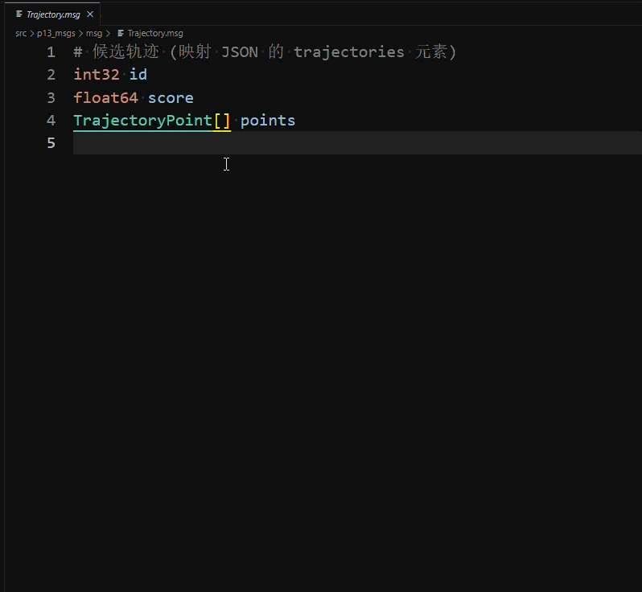

# IntelliSense Support

The Robot Developer Extensions for ROS 2 provides rich IntelliSense support for ROS message files (`.msg`, `.srv`, `.action`), making it easier to work with ROS interfaces.

## Message File IntelliSense

When working with ROS message files, the extension provides several IntelliSense features to help you understand message structures.

### Hover Information

Hovering over message types or field names displays detailed information about the type, including its properties.

### Completion and Go to Definition

Typing inside a message file offers type completion (including workspace and system packages), and **F12** / **Ctrl+Click** on a message type jumps straight to its definition file — including the field-level completion shown below:



#### Hovering Over Message Types

When you hover over a message type (such as `geometry_msgs/Point`, `std_msgs/Header`, or `builtin_interfaces/Duration`), the hover tooltip displays:

- **Package name**: The ROS package containing the message
- **Message type**: The name of the message
- **Properties**: A formatted list of all fields in the message, including:
  - Field types and names
  - Array notation (fixed size `[N]` or dynamic `[]`)
  - Default values and constants
  - Inline comments from the message definition

**Example**: Hovering over `geometry_msgs/Vector3` shows:
```
geometry_msgs/Vector3

Package: Geometric primitive messages for representing common geometric shapes
Message Type: Vector3

Properties:
float64 x
float64 y
float64 z
```

#### Hovering Over Field Names

Hovering over a field name provides comprehensive information about both the field and its type:

- The field declaration with any default values
- Inline comments associated with the field
- Complete type documentation (same as hovering over the type)
- All properties of the field's message type

**Example**: Hovering over `angular_velocity` in the line:
```
geometry_msgs/Vector3 angular_velocity
```

Shows the field declaration, followed by complete documentation about the `Vector3` type and its properties.

#### Built-in Types

When hovering over ROS built-in types (such as `int32`, `float64`, `string`, etc.), the extension displays:

- Type name
- Description of the type
- Range information where applicable
- Array information if the field is an array

**Example**: Hovering over `float64` shows:
```
float64

64-bit floating point number (double precision)
```

### Workspace and System Packages

The IntelliSense features work seamlessly with both:

- **Workspace packages**: Messages defined in your current workspace
- **System-installed packages**: Messages from installed ROS packages (e.g., `geometry_msgs`, `sensor_msgs`, `builtin_interfaces`)

The extension automatically searches for message definitions in:
1. Your workspace folders
2. ROS package paths (obtained from the ROS environment)

This means you get the same rich hover information whether you're working with custom messages or standard ROS messages.

### Go to Definition

Press **F12** or **Ctrl+Click** (Cmd+Click on macOS) on a message type to jump to its definition file. This works for both workspace and system-installed packages.

### Supported File Types

IntelliSense features are available for:

- **`.msg` files**: ROS message definitions
- **`.srv` files**: ROS service definitions
- **`.action` files**: ROS action definitions

## Xacro / URDF Navigation

For `.xacro` and `.urdf` files the extension builds an include graph and provides precise navigation: **Ctrl+Click** on an `<xacro:include filename>` opens the included file; **F12** on a macro call, `${}` property/argument reference, or a link/joint name jumps to its definition (with macro-parameter shadowing taken into account), along with hover documentation and D1–D14 diagnostics:


## Launch File Navigation

In launch files (`.launch.py` / `.launch.xml` / `.launch.yaml`), **Ctrl+Click** on an include target opens the referenced launch file, and on a `pkg=` / `executable=` value jumps to the package directory or the executable's source file (unresolved targets are clearly indicated instead of navigating to a wrong place):


## C++ and Python IntelliSense

For C++ and Python code that uses ROS, run the command **ROS2: Regenerate IntelliSense Configuration (incremental)** from the command palette. The extension maintains both engines for you:

- **cpptools**: keeps `.vscode/c_cpp_properties.json` include paths in sync (ROS install paths + your workspace packages);
- **clangd**: keeps `.clangd` in sync (workspace `-I` entries + per-prefix `-isystem` entries) and merges every package's `compile_commands.json` into `build/compile_commands.json`;
- The engine is selectable via `ROS2.ide.intellisenseEngine` (`auto` / `cpptools` / `clangd` / `both` / `none`); paths are regenerated automatically when packages or the ROS environment change.

## Tips

- **Keep your ROS environment sourced**: Make sure your ROS environment is properly sourced so the extension can find all package definitions
- **Reload after installing packages**: If you install new ROS packages, you may need to reload the VS Code window to pick up the new definitions
- **Check hover information during development**: Use hover information to quickly verify message structures without switching files
- **Combine with Go to Definition**: Use hover to preview, then F12 to dive into the full definition when needed
