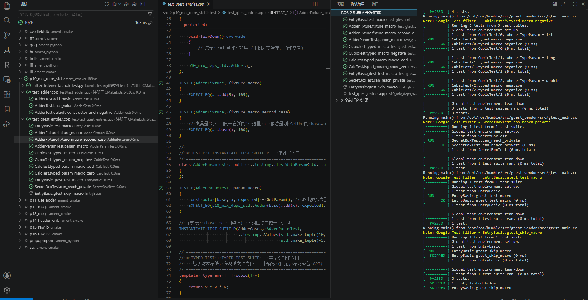

# Test Explorer

The extension integrates with VS Code's Test Explorer to discover and run ROS 2 tests directly from the editor: per-package and per-file test items are marked in the editor, results are reported back per case, and unbuildable/unrunnable items are explicitly labeled:



## Supported Test Types

The Test Explorer automatically discovers the following test types:

* **Python (pytest)** — tests collected by `pytest` (`unittest.TestCase` cases are driven by pytest as well)
* **C++ GTest** — tests defined with Google Test (`TEST` / `TEST_F` / `TEST_P` / `TYPED_TEST` / `TYPED_TEST_F` / `TYPED_TEST_P` / `GTEST_TEST`)
* **Launch tests** (`launch_testing`, e.g. `*_launch_test.py`) — run **whole-file** (the framework has no per-case
  selector); their per-case children are display-only result slots

> **Non-runnable items are marked, not silently skipped.** Every real test item carries the `runnable` tag, and the
> Run profile is bound to that tag (VS Code only executes tagged items). Informational children (the "why is there
> no test here" note under a package) and launch-test case slots therefore have **no Run button** and are never
> picked up by "Run All". Packages whose `build/<pkg>` directory does not exist yet also lose their package-level
> Run entry point until they are built.

## Using the Test Explorer

1. Open the Test Explorer view in VS Code (click the test flask icon in the Activity Bar)
2. The extension automatically discovers tests in your ROS 2 workspace
3. Tests are organized as **package → test file → test case** (three levels), using the real package names from the
   package domain (`package.xml <name>`), so same-named files in different packages stay distinguishable
4. Use the **Run** button to execute tests; the view toolbar also offers a **refresh** button
5. Filtering: type a name, `@ext:py`, or `@tag:pytest` / `@tag:gtest` / `@tag:pkg:<name>` in the filter box
   (every item carries those tags)

## How tests are executed (three granularities)

| Granularity | Python (ament_python) | C++ (ament_cmake gtest) | Launch test |
|:--|:--|:--|:--|
| **Package** (click a package node) | `colcon test --packages-select <pkg>`, results read from `build/<pkg>/pytest.xml` | same command, results from `build/<pkg>/test_results/**/*.gtest.xml` | same command, results from `build/<pkg>/test_results/**/*.xunit.xml` |
| **File** (click a test file) | `python3 -m pytest <file> --junitxml=<tmp>` with **cwd = the package directory** | `<exe> --gtest_output=xml:<tmp>` (executable resolved from `build/<pkg>/CTestTestfile.cmake`) | `python3 -m launch_testing.launch_test <file> --junit-xml=<tmp>` (cwd prefers `build/<pkg>`) |
| **Case** (click a test case) | `<file>::<Class>::<method>` selector | `--gtest_filter=<real name>`, e.g. `*/AdderParamTest.param_macro/*` for `TEST_P` | — (whole file only) |

Judgement is always based on the **result artifact** (junit / gtest XML), never on the exit code alone:
`pytest` exit codes `4`/`5` mean "nothing was collected" (reported as *errored*, not failed), and `gtest` exits `0`
even when the filter matches nothing (that case is reported as *errored* instead of a silent pass).

The extension does **not** build for you: if a test executable is missing, the item is reported as *errored* with a
hint to run `colcon build <pkg>` first (the official flow is build → test). Package-level runs are additionally
gated **before** spawning anything: `COLCON_IGNORE` packages and packages without `build/<pkg>` are reported
immediately (no `colcon` process is started).

## Test Discovery

**Where each language's list comes from** (updated 2026-09-24):

* **Python (`pytest`)** — a source scan of the workspace for `test_*.py` / `*_test.py` / `*.test.py`
  (case-insensitive). Files **outside** any ROS package are still listed (a plain pytest file can
  legitimately be run directly) and land under the "(unclassified)" node.
* **C++ (gtest) and launch tests** — the **build records**: the `add_test` registrations in
  `build/<pkg>/CTestTestfile.cmake`. The test kind comes from `LABELS` (`gtest` / `launch_test`), the
  executable (gtest) or the source file path (launch) from the registration's `--command`, and the
  declaration site (`CMakeLists.txt:<line>`) from `_BACKTRACE_TRIPLES` — shown in the item's
  description. Consequently:
  * a `.cpp` test that has never been built is **not shown** (there is nothing to run — this is the
    official build → test flow, and the extension never builds for you);
  * `*_launch_test.py` no longer needs content sniffing — the registration is authoritative;
  * after `colcon build <pkg>` that package's registrations are re-read automatically (no manual
    refresh needed), and a test whose registration disappeared is pruned.

Discovery is **incremental**, not a periodic rescan:

* saving a test file re-parses **only that file** (its previous results are invalidated immediately) — added or
  removed test cases appear/disappear in the tree;
* creating or deleting a test file adds/removes just that file's node;
* adding/renaming/removing a package (or toggling `COLCON_IGNORE`) updates only the affected package;
* `colcon build <pkg>` updates that package's state automatically (Run entry point / "not built" note);
* a manual full rescan is always available: the view's **refresh** button or the `ROS2.tests.refresh` command
- The `ROS2.tests.runAll` command (run the whole workspace's tests) runs `colcon test` for every package in the workspace (serially) and fills results back from the official artifacts; use the test view for single-package or single-case runs.
  (which reports how many items were discovered). Automatic rescans keep the previous tree if the file scan times
  out; a manual refresh forces the result through.

### Filtering Test Discovery

You can exclude specific folders from test discovery (and from package scanning) to keep third-party or submodule
tests out of the Test Explorer. The setting is shared with build/package scanning:

**Settings:**
- **ROS2.search.excludeFolders**: list of folder paths (or directory names) to exclude

**Example configuration** (`.vscode/settings.json`):

```json
{
  "ROS2.search.excludeFolders": [
    "build",
    "install",
    "log",
    "node_modules",
    "${workspaceFolder}/external",
    "submodules"
  ]
}
```

**Path formats supported:**
- Absolute paths: `/absolute/path/to/exclude`
- Relative paths / directory names: `submodules`, `external` (relative to the workspace root)
- Variable substitution: `${workspaceFolder}/external`

When a folder is excluded, everything inside it (including test files in its subdirectories) is ignored during
test discovery.
