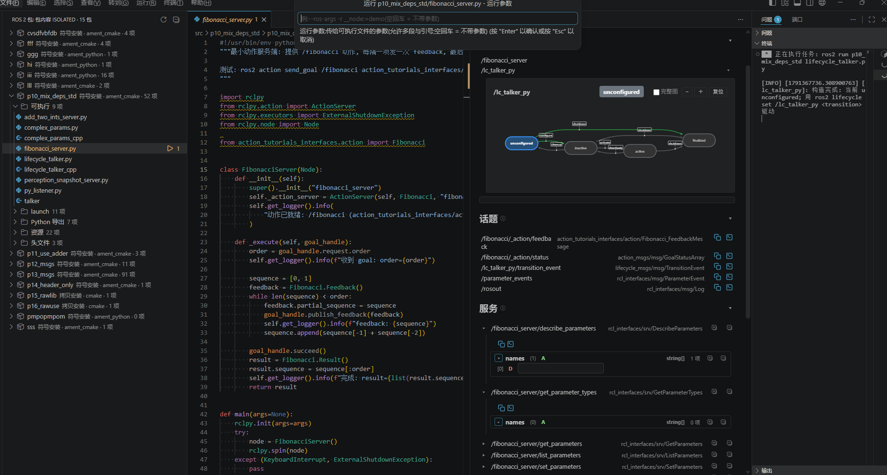
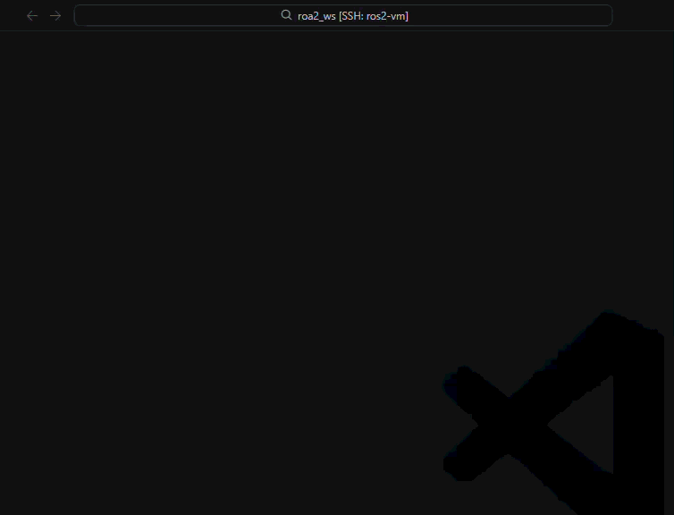

# 使用

## 包内容侧边栏

点击活动栏的「ROS 2 包」图标,即可基于 **install 目录的实际内容**浏览工作区内每个包:可执行文件、launch 文件、Python 导出、资源与头文件,行内一键运行 / 构建,点击跳转源码。从状态栏打开的状态页展示实时节点 / 话题 / 服务 / 参数与生命周期状态图(含转换操作):

## 命令

通过[命令面板](https://code.visualstudio.com/docs/getstarted/userinterface#_command-palette)(`Ctrl+Shift+P`)可用:

| 命令 | 说明 |
|---|:---|
| ROS2: 创建终端 | 创建预加载 ROS 环境的终端。 |
| ROS2: 打开 ROS 2 状态页 | 打开状态页(节点 / 话题 / 服务 / 参数 / 生命周期)。 |
| ROS2: 运行 ROS 可执行文件 (ros2 run) | 选包选可执行,支持参数预设与按目标记忆。 |
| ROS2: 运行 ROS 启动文件 (ros2 launch) | 选启动文件,支持参数预设与按目标记忆。 |
| ROS2: 构建 ROS 2 包 | 智能构建:多选包,再选额外参数预设。 |
| ROS2: 重新生成智能感知配置(补写) | 重新同步 cpptools / clangd 的 include 路径与 compile_commands.json。 |
| ROS2: 使用 rosdep 安装此工作区的 ROS 依赖 | 等价于 `rosdep install --from-paths src --ignore-src -r -y`。 |
| ROS2: 运行 ROS 2 Doctor 诊断 | 在 ROS 终端执行 `ros2 doctor`。 |
| ROS2: 刷新测试发现 / 运行所有测试 | 驱动[测试资源管理器](test-explorer.md)。 |
| ROS2: 显示入门指南 | 打开入门演练。 |

资源管理器中右键文件夹可**切换 Colcon 忽略**、**Colcon 构建(Release/Debug)** 与三个**创建包**向导(C++ / Python / 混合,内置依赖选择与命名校验)。

## 构建包

`Ctrl+Shift+B`(或 **ROS2: 构建 ROS 2 包**)启动智能构建流程:多选要构建的包,再按需勾选参数预设(如详细输出)或手输自定义参数——选择会被记住供下次使用。构建命令本身可经设置中的 `ROS2.build.shareSpec` 模板完全自定义;构建前会预检安装形态(符号/拷贝)与布局(合并/分包)冲突,提前给出修复建议:

资源管理器右键可切换 `COLCON_IGNORE`,将文件夹(及其子树)排除出发现与构建。

## 智能感知

扩展自动维护 C++ 与 Python 的智能感知路径。详见[智能感知文档](intellisense.md)——含消息文件补全/跳转、xacro 与 launch 文件跳转。
