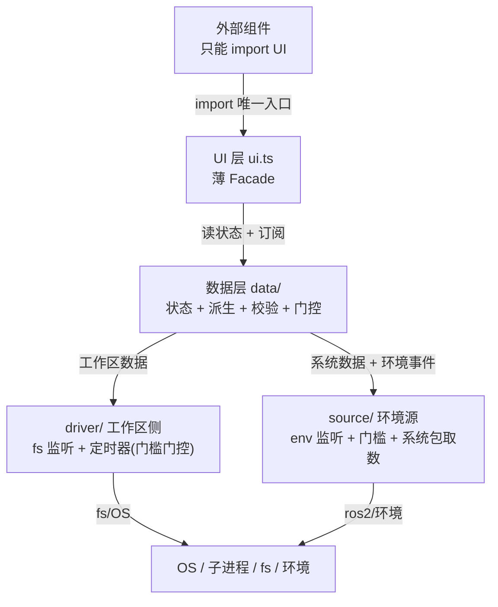
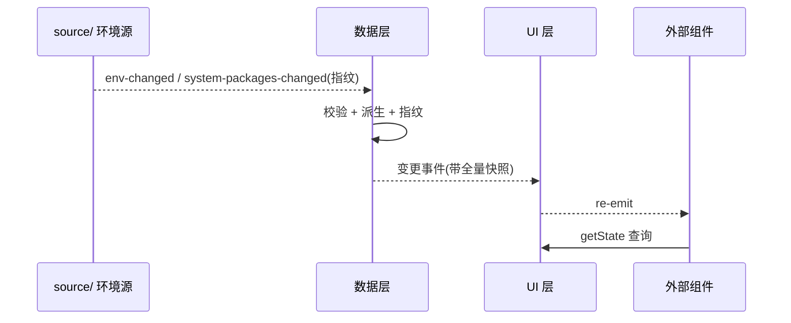

# package-core 三层解耦设计 (2026-08-23, 持续更新)

> 目标：把"包数据"相关逻辑拆成 UI / 数据 / 驱动 / 环境源；外部组件只能 import UI；
> 简化接口冗余（不同组件暴露不同函数、返回相同数据 → 一次性提供多个数据、多组件共用）；
> 一上一下、数据夹中间，从结构上消除循环依赖。
> 详细设计讨论见 `设计/重构/package-core三层解耦-2026-08-23/`（00 总览 / 01 启动口 / 02 结构 / 03 过渡桥 / 04 环境源）。

## 0. 实施进度（当前状态）

| 项 | 状态 |
|:--|:--|
| `source/` 环境源（contracts/env-watcher/env-state/system-packages/ros2-exec/index） | ✅ 已创建（自包含；未接入数据层） |
| 数据层去抽象（DataLayer 直接注入 cache+exeMap，去掉 WorkspaceSource） | ✅ 已完成 |
| **3 个接入口**（ingestPackageCreated / toggleIgnore / getBuildPackages） | ✅ 已实现（数据层+UI+组装点） |
| 数据层接入 source/（EnvironmentSource 取代 fetcher） | ⬜ 待许可 |
| driver/ 重构（ros2-exec 移入 source/、定时器门槛门控） | ⬜ 待许可 |
| UI / API 去掉 forceRefresh | ⬜ 待许可 |
| **共享类型 + 契约收编**（shared/types + driver/contracts，删 ports.ts） | ✅ 已完成 |
| extension 挂载 / colcon-utils 替换 | ⬜ 待许可 |

## 1. 目录结构（当前实际）

```
src/build-tool/package-core/
├── DESIGN.md
├── shared/               # 共享值类型(跨层传递,一处定义防形状漂移)
│   └── types.ts          #   PackageEntry / ExecutableInfo
├── ui.ts                 # UI 层(单文件、薄):查询透传 + 事件 re-emit(仍含 forceRefresh,目标去掉)
├── data/                 # 数据层:状态(工作区+系统) / 派生 / 校验 / 调度
│   ├── state.ts          #   统一快照 5 域 + 分域事件 + 指纹
│   ├── derive.ts         #   派生 workspace / all
│   ├── validate.ts       #   权威校验(package-xml)
│   └── index.ts          #   DataLayer(fetcher, cache, exeMap) + 3 接入口 + onDidChange
├── driver/               # 驱动层(当前:定时器 + fs 监听 + ros2 取数;重构待许可)
│   ├── contracts.ts      #   驱动契约:DriverEvent / PackageFetcher(过渡)
│   ├── timer.ts          #   60s 定时器(门槛门控:无 env 空转/跳过)
│   ├── fs-watcher.ts     #   vscode 监听 package.xml / COLCON_IGNORE + 去抖
│   ├── ros2-exec.ts      #   ros2 取数(目标移入 source/)
│   └── index.ts          #   createPackageFetcher()
└── source/               # 环境源(已创建):环境监听 + 门槛 + 系统包取数 + 指纹事件
    ├── contracts.ts      #   EnvironmentSource / EnvEvent / SystemSnapshot / Ros2ApiLike(共享类型来自 ../shared/types)
    ├── env-watcher.ts    #   系统环境监听(watchEnv 注入,惰性)
    ├── env-state.ts      #   环境可用性 + 门槛(从无到有上升沿,单次)
    ├── system-packages.ts#   系统包取数(list/prefix/executables) + 指纹 + 变更事件
    ├── ros2-exec.ts      #   ros2 命令执行(依赖环境)
    └── index.ts          #   createEnvironmentSource()
```

## 2. 分层与依赖方向（无环）

依赖只朝下：外部 → UI → 数据 → (driver / source) → 基础设施。driver（工作区侧）与
source（环境侧）都是数据源生产者，均不 import 数据层 / UI 层。



## 3. 门槛 vs 门控（核心语义）

| 概念 | 含义 | 判断依据 | 语义 | 作用 |
|:--|:--|:--|:--|:--|
| **门槛** (threshold) | 是否有环境 / source | `isRosEnvAvailable()` | 单次、从无到有（上升沿） | 门控定时器 / 系统包取数（ros2 命令） |
| **门控** (gate) | 是否有合法工作包 | 快照 unignored/all 非空 | 随数据变动通知一起发 | 消费方判定功能可用性 |

- 门槛是**单次监控**（无 → 有）；重复 source 不算新门槛，仅"系统环境变化"（重取系统包）。
- 门控是"**数据变动通知的一部分**"，不是独立开关。

## 4. 定时器（保留 + 门槛门控）

- **定时器保留，不删除**；由门槛（env）门控。
- 无 env → 空转/跳过（ros2 / colcon list 必然报错，无执行必要）。
- 有 env → 周期 tick 执行刷新，**覆盖事件监听遗漏的部分**（监听即时但不准，强制刷新准确但慢）。
- 实现倾向：定时器始终启动、每 tick 检查门槛。

## 5. 各层职责

### UI 层（薄、单文件）
- 查询透传（getState / getSystemDir / getExecutables / getBuildPackages）
- 事件出口（onDidChange，分域事件：仅变化域带新值）
- 命令接入口（forceRefresh / ingestPackageCreated / toggleIgnore）
- 当前仍含 forceRefresh（目标：去掉，门槛驱动启动）

### 数据层（夹中间，多文件）
- 统一状态快照（workspace / unignored / ignored / system / all + fingerprint，5 域）
- 派生计算 + 权威校验
- 当前：`DataLayer(fetcher, cache, exeMap)` —— cache/exeMap 直接注入（已去 WorkspaceSource 抽象）
- 目标：`DataLayer(source, driver, cache, exeMap)` —— source 取代 fetcher
- **共享 cache 不 dispose**（多消费方共用）

### 驱动层（底部）
- fs 监听（package.xml / COLCON_IGNORE）+ 去抖 + 廉价预过滤（不依赖环境）
- 定时器（门槛门控）
- 目标：ros2 取数移入 source/

### 环境源 source/（环境侧数据源）
- 系统环境监听（bashrc 等）→ 变化 → 门槛判定 → 重取系统包 → 指纹 → 事件通知下游（"传递变化"）
- 系统包取数（list / prefix / executables，依赖环境）

## 6. 数据流（事件驱动，事件自下而上 / 查询自上而下）



## 7. 5 类数据映射

| # | 用户命名 | 现状数据源 | 新结构落位 |
|:--|:--|:--|:--|
| 1 | ignoredPackages | package-cache.snapshot.ignore（colcon 祖先语义） | 数据层快照 ignored |
| 2 | unignoredPackages | package-cache.snapshot.unignore（colcon 权威） | 数据层快照 unignored |
| 3 | 系统包列表 | rosApi.getPackageNames()（ros2 pkg list） | 数据层快照 system（dir 懒取） |
| 4 | 某系统包路径 | rosApi.getPackages()[name]() 懒解析 | 数据层懒查询 getSystemDir → source/ 取数 |
| 5 | 某系统包可执行列表+路径 | rosApi.findPackageExecutables() 已存在 | 数据层懒查询 getExecutables（工作区→executable-map，系统→source/） |

要点：集合型便宜数据（unignored / ignored / system）随快照一次带全，另派生 workspace / all；单包细节
（系统包路径 / 可执行列表）是每包一次子进程的开销，必须保持懒查询，不能全量塞快照。

## 8. 现状模块落位

| 模块 | 归属 |
|:--|:--|
| package-cache（快照+指纹+事件） | 数据层（状态核心，直接注入） |
| package-xml / package-scan / package-fs / colcon-scan | 数据层（校验/计算） |
| executable-map / setup-parser / cmake-parser | 数据层（工作区可执行计算，直接注入） |
| package-map 系统包两级加载 | 数据层（调度/状态）→ 目标并入 source/ |
| listeners.ts（watcher + 去抖） | 驱动层（fs 监听） |
| 60s 定时器（门槛门控） | 驱动层（timer，保留） |
| rosApi / colcon-exec（子进程执行） | 环境源 source/（ros2 执行） |
| package-store / colcon-utils（旧壳） | UI 层前身 → 被薄 Facade 替代 |
| extension / commands / languages / debugger / build-tool | 外部，只 import UI |

## 9. 迁移节奏与 TODO

1. ✅ 数据层去抽象：DataLayer 直接注入 cache + exeMap（已完成）
2. ✅ source/ 环境源（已创建，自包含）
3. ✅ 3 个接入口（ingestPackageCreated / toggleIgnore / getBuildPackages）
4. ⬜ 数据层接入 source/（EnvironmentSource 取代 fetcher）
5. ⬜ driver/ 重构（ros2-exec 移入 source/、定时器门槛门控）
6. ⬜ UI 去 forceRefresh；✅ 删 ports.ts（类型收编到 shared/types + driver/contracts）
7. ⬜ extension 挂载 / colcon-utils 过渡桥替换

## 10. 旧接口 → 新接口映射

旧 `colcon-utils` 各接口应接到哪个新接口（按功能/数据类型相近，不要求 100% 相同），
完整表见 `设计/重构/package-core三层解耦-2026-08-23/05-接口映射表.md`。核心对应：

| 旧 (colcon-utils) | 新 (package-core) |
|:--|:--|
| getPackages（构建快路径） | **getBuildPackages()** |
| getCachedPackages / getAllPackages / hasCachedPackages / findPackageForPath | getState()（unignored/all + 门控自算 + 本地匹配） |
| setPackagesChangedListener | **onDidChange()**（分域事件：仅变化域带值） |
| toggleColconIgnore | **toggleIgnore(dir)** |
| handlePackageXmlChange("create") | **ingestPackageCreated(path)** |
| consumeLastPackageDiff | onDidChange 订阅 + 消费方自算 diff |
| flushPackagesSync* / startBackgroundRefresh / invalidatePackagesCache / refreshIgnoredPackages | 不再对外（内部 commit / 定时器门槛门控 / fs 事件） |
| setEnvAvailable | source/env-state（迁入 source/） |
| resolveInstallType / getPackageNameFromXml / isValidPackageXml | 不变（非包数据 / 数据层内部） |

